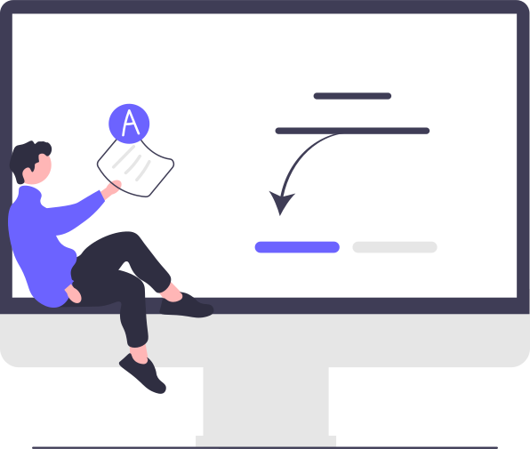

 

 
 

<h1 align="center">Hi there👋, I'm Tomás Falchini.</h1> 
  

<h3 align="center">Full Stack Developer</h3>
    
 
 
 
  
  
 

 
 

  
<h2 align="left">A passionate about technology, exploring the world of development. I like to create new things, and I know that learning is a never-ending road of discovery, challenge and inspiration, so I'm always learning. There you can find all the proyects I have been working on. </h2>
 

 
 

 
 
 
 

## ⚙️ Tech skills:

### I had worked with the PERN and MERN Stack. Also, I have used some of the most demanded technologies, like Firebase, Google Cloud, GoogleMapsAPI, Redux, Sequelize, Jest, Jazmine, Sass, Less, and more. 
 

                           

 
 

## 🤝 Soft Skills:

### With a background in Geospatial Engineering, I have a strong sence of organization, and know how to collaborate with other professionals. I'm a team player with a leadership profile. I always take a positive attitude to learning from setbacks. Also, I have an excelent written and oral communication. I'm a goal oriented person, who always wants to achieve them and does whatever it takes to reach the goal.

 
 

## 💬 Languages:

 - **English** (B2 Upper Intermidiate).
 - **Native Spanish**

 
 

## 📫 How to reach me:

### Email:
- **tomasfalchini@gmail.com**

<h3 align="left">Or connect with me:</h3>

 

<!---
TomasFalchini/TomasFalchini is a ✨ special ✨ repository because its `README.md` (this file) appears on your GitHub profile.
You can click the Preview link to take a look at your changes.
--->

